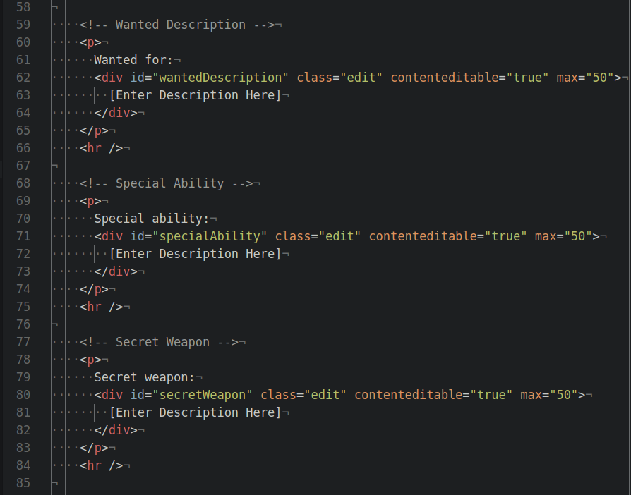
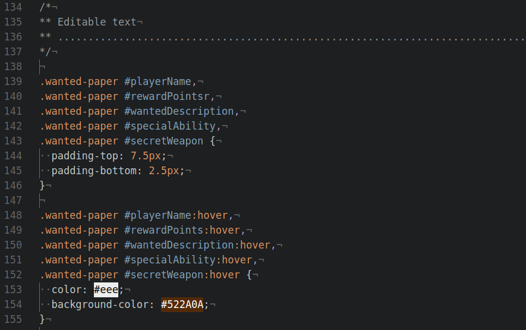
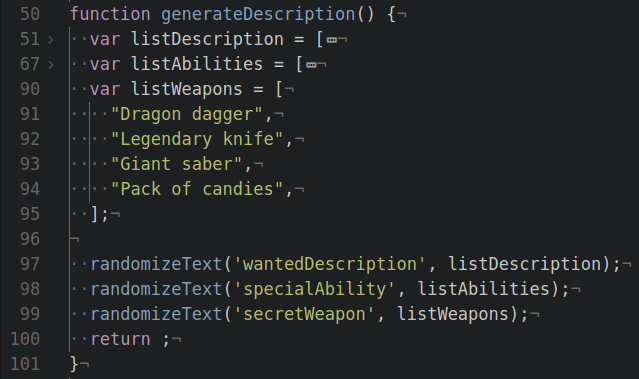
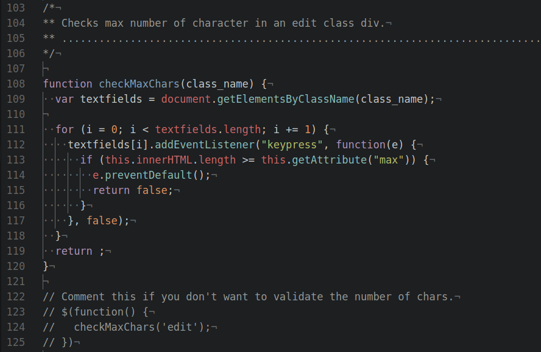

  

# Hometrap - Printable escape room for families

The goal of the project was to create a captivating experience for families via a printable version of an escape game combined with interactivity with website. The physical version of the product includes a personalized pirate kit with a treasure box, a pirate map, a personalized wanted poster, riddles, loot, and more...

* [See the presentation here!](https://app.storymakers.eu/preview/59cc96541486673411453e83)
* [Try the demo here!](https://jraleman.com/hometrap)

## 42 Hackathon ESCP

42 Silicon Valley partnered with ESCP to do a 24 hour hackathon October 16th through October 17th. This way, 42 students can experience how it is to work with business students.

ESCP Europe is the oldest business school in the world. Its mission is to develop the next generation of transnational business leaders, preparing them to embrace the opportunities offered by cultural diversity. With six urban campuses in Berlin, London, Madrid, Paris, Turin and Warsaw, ESCP Europe's true European Identity enables the provision of a unique style of cross-cultural business education and a Global Perspective on international management issues.

### Team

- [Felix Muth](https://www.linkedin.com/in/felix-muth-48071b66/)
- [Michele Greco](https://www.linkedin.com/in/michele-greco-53723051/)
- [Richard Muller](https://www.linkedin.com/in/)
- [Jose Ramon Aleman](https://www.linkedin.com/in/jraleman/)

## Updating Sections

If you want to update the poster generator (adding more sections to it), follow these steps:

### index.html

Open up the index.html file with a text editor, and add a new section. For example, if I want to add a *Secret Weapon* section, I would do it like this:

* Create a unique id in the div tag `id="secretWeapon"`.
* To set up a max number of characters that can be entered, change the value of `max="50"`; where `50` is the number of characters.

### css/styles.css

Next, add the id of the section to the following css rule:

* Add it like line `143` and `152`.

### js/scripts.js

Finally, create a new list in the JavaScript function `generateDescription()` and pass the id and the list as parameters to the `randomizeText()` function:

* The list can be named however you want, but try to keep consistency.

If you want to toggle the validation of maximum number of characters for the sections, uncomment line `123`, `124`, and `125`.

## Known Issues

- Characters cap for editable text don't work in Firefox.
- Improve random number generator algorithm.

# License

This project is free software: you can redistribute it and/or modify
it under the terms of the GNU Affero General Public License as
published by the Free Software Foundation, either version 3 of the
License, or (at your option) any later version. For more information, see <http://www.gnu.org/licenses/>
